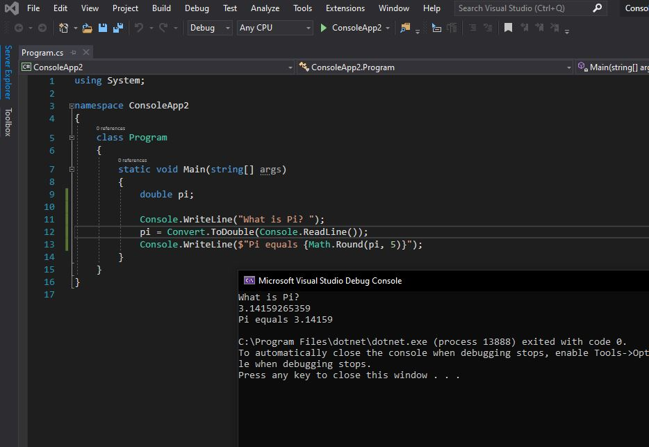

# TARge19-Homework-Assignment-2
## Deadline 11.10.2019
*C#, Console, IF-Statements, Data Types*
## Paber, kivi, käärid
### Osalejad: arvuti, kasutaja
#### Mängu reeglid:
1. Programm tervitab kasutajat nimepidi ja palub ta sisestada “paber”/”paper”, “kivi”/”rock” või “käärid”/scissors”
2. Arvuti genereerib juhuslikku numbrit vahemikus ühest kolmeni (kaasa arvatud). 1 - paaber, 2 - kivi, 3 - käärid.
3. Reeglid: käärid lõikavad paberit, paber katab kivi, kivi nürib käärid. Iga võidu eest saab osaleja, kas arvuti või mängia ühe punkti.
Mäng lõpeb siis, kui üks osalejast saab kolm punkti ja võidab mängu. 


# TARge19-Homework-Assignment-1
*C#, Console, IF-Statements, Data Types*
## Deadline 27.09.2019

### Kasutades valemit ja tabelit aadressil https://www.kalkulaator.ee/et/kehamassiindeks loo kehamassiindeksi kalkulaator. 
1. Programm küsib kasutaja nime ja vastuseks tervitab teda nimepidi.
2. Programm küsib kasutaja vanust. Kui kasutaja on noorem, kui 20 aastat või vanem, kui 60 aastat, siis kasutajale antakse viisakalt teada, et antud programm annab õigeid tulemusi vaid vanusevahemikus 20-60 aastat ja arvutamist ei toimu.
3. Kui kasutaja vanus on 20 - 60 vahemikus, siis programm arvutab kehamassiindeksit ja teavitab kasutajat selle seisust (vaata tabel).

Valem:  Kehamassiindeksi leidmiseks jagatakse kehakaal **kilogrammides** pikkuse ruuduga **meetrites**.
```
double weight;
```
```
double height;
```


*to convert double value to string: Convert.ToDouble(double type value)*

## Doubles 



Valmis projektikood peab olema üles laaditud Teie GitHub’i. Tähtaeg on 27. september 2019. Palun saata link oma rep​ositooriumile mulle meiliga.
